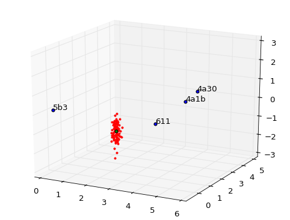
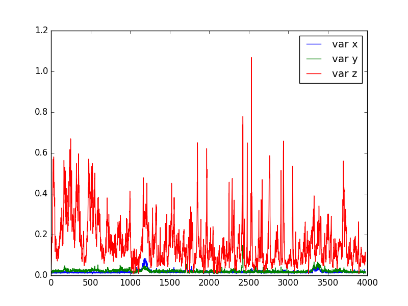
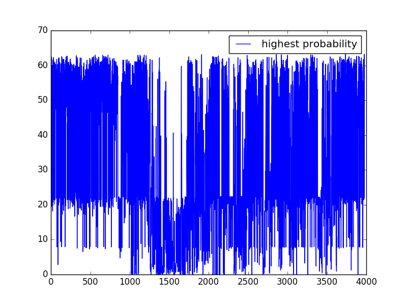
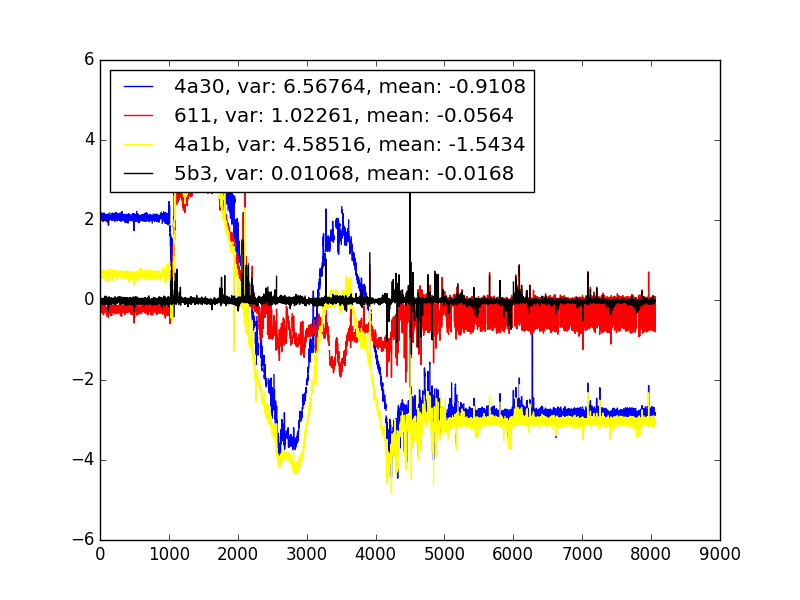

# Particle filter for lps tag (proof of concept)

# How to use
To run the particle filter use:
```
python particlefilter.py
```
Make sure that the path to the map of anchors is in the script main function as well as the file with samples from a tag.


## Algorithm
1. Get map with anchors (possible to add and remove under ongoing process)
2. Init m particles uniformly on the map ··
···Particles will have:··
··* position: {x,y,z}
··* state vector: [{addr:<addr>, ddist:<ddist>},{addr:<addr>,...}] (calculated from {x,y,z})
··* Weight: w (normalized)
3. Calculate the weight ··
···The weight is calculated by the multidimensional Gauss distribution where the axes are representing one anchor.
4. The weight is normalized (w_i/sum(w_i)=weight)
5. Re-sample particles (low variance sampling)
6. Move particles according to accelerometer/gyro
7. Calculate new state vector
8. Go back to step 3


## Assumptions
* Measurements form anchors (ddist) is uncorrelated (Sigma matrix is diagonal)
* Measurements are normal distributed
* The tag will have had the same acceleration from the previous measurement until the latest measurement
* Accelerometer has the same variance for all axis 


## Miscellaneous
If all anchors are in or close to be in the same plane, the tag will have a good estimate of the position in that plane, but not in the third axis perpendicular from the plane.


## Results



The tag is hanging slightly above the plane the anchors are in. Blue points are anchors, red are the estimated states "particles" and the green is the particle with the highest probability


The path using 100 particles. The big jump from above and belove the plane of anchors is due to that the anchors are all placed in a plane (or close to), which lead to that there will exist two possible maxima of particles. As can be seen in the graph of variance for the z axis. The trace in the xy plane is quite close to the "true" movement.



Variance in xyz 



The highest probability of all particles



Plot of ddist
